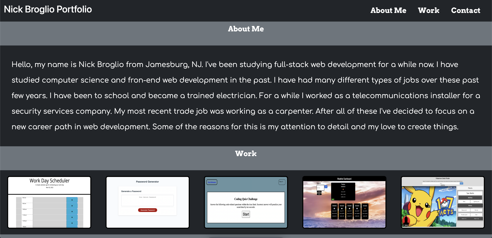

# Nick Broglio Portfolio

## Description

After updating my portfolio, I added many changes. I decided to use a bootstrap framework for this. Also, I've added a better description of myself, added my homeworks and projects to be active links, imported fonts from google fonts.

